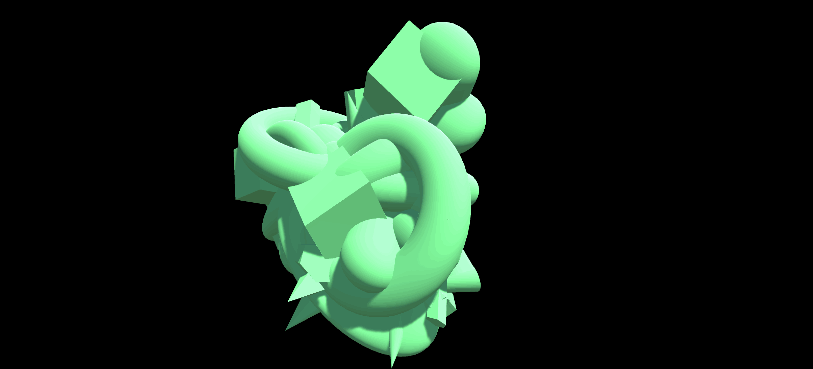
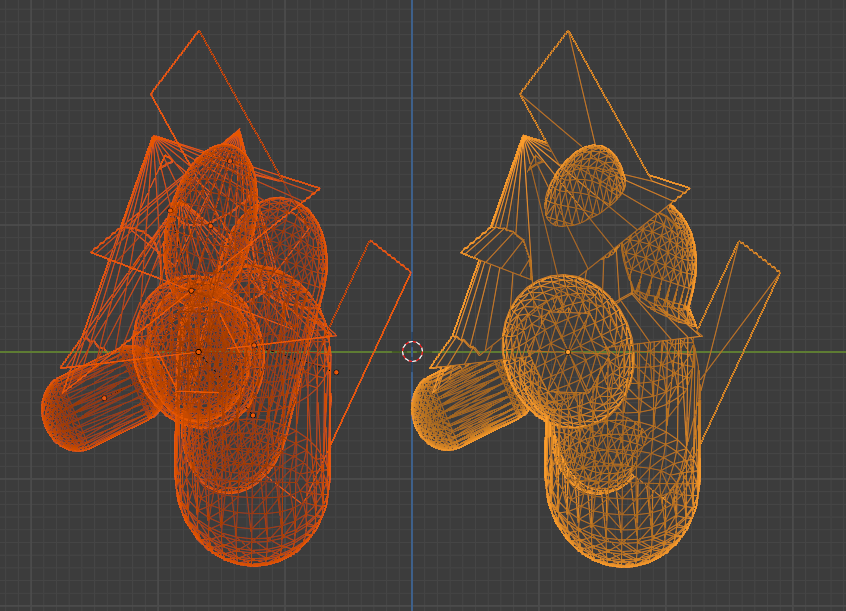

# fractal-primitives-unity

# Purpose
This project generates fractal tree and puts primitives on it. Inspired by [Catlike Coding Unity C# Tutorials](https://catlikecoding.com/unity/tutorials/constructing-a-fractal/).

The aim is to generate 3d training data from scratch, to increase performance in 3D deep learning, such as point cloud registration or feature matching. 

Although no significant performance improvement has been found by training such networks by ONLY using this dataset, mixing this data with other existing data such as [ModelNet](https://modelnet.cs.princeton.edu/) and [ABC](https://deep-geometry.github.io/abc-dataset/) will help to gain performance.

*Example neural network to use this:  [RPMNet](https://github.com/yewzijian/RPMNet/tree/74f6531968bc084e44231e397da640432cd42a4b), [PointNetLK](https://github.com/hmgoforth/PointNetLK), [DCP](https://github.com/WangYueFt/dcp)*

# Content

This repository contains two steps.

1. Generating primitive based fractals into `.fbx` format (Unity)
    - Depends on [FbxExporter](https://github.com/unity3d-jp/FbxExporter)
    - Used [Free Primitives](https://forum.unity.com/threads/release-free-primitives.234595/#post-1557127)
1. Applying boolean operation to generated `.fbx` ensure watertight (one membrane, no holes, no meshes inside meshes) 3d mesh, saving as `.obj`. (Blender)
    - Depends on [booltron](https://github.com/mrachinskiy/booltron)

# 1. Data generation

Tested with `Windows 10` with `Unity 2020.3.3f1`.

This project saves `.fbx` file, and processes them into watertight meshes using blender (blender part to be added)

## Usage
### Generate one fractal primitive
- clone the repository and open up using UnityHub
- open up the `GeneratroScene` scene
- start the scene, select `FractalGenerator` Object, and hit `Create`
- hit again, and different fractal will pop up

### Generate and save hundreds of fractal primitives
- clone the repository and open up with Unity
- open up the `GeneratroScene` scene
- Inside `FractalRecorder` Object, edit `FractalGenerateAndSave` scripts' path to save and numver to save.

*NOTE : If you run deeper fractal tree generation, time to save also needs to be tuned longer.*

### Customization
- You can edit `FractalObject.prefab` in `Assets/Resources` to change generation behavior
    - You also can add / remove / change Meshes to use for generating fractal primitives
- Note that if you make depth deeper, increase `wait_time` in `FracatlGenerateAndSave`, since it'll take while to generate complete fractal tree and put primitives in.

# 2. Boolean Operation

Tested with `Blender 2.9.1`.

## Usage
- install [booltron](https://github.com/mrachinskiy/booltron) into your Blender
- Open Blender, delete all the detault objects
- Go to `Scripting` tab, open python script
    - `automatic_boolean_operation.py` will simply apply union operation
    - `automatic_boolean_operation_various.py` will randomly apply union / difference / intersect operation
- Set correct path
- Execute it (Alt+P)

*NOTE : You can try applying `automatic_disp_noise.py` afterwards, to add some noise to the models as well. You can try adding subdivision beforehand / try sulpting tool instead for further randomization.*

Before (left) and After (right) the boolean union operation

# License
MIT License

